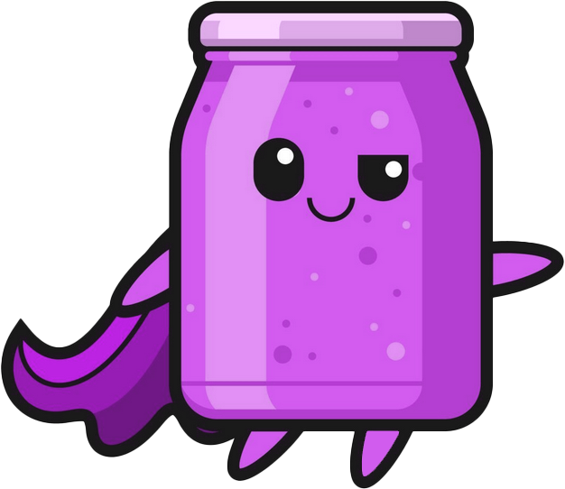

<h1 style="display:inline-flex">
     
    <div style="font-weight:900;text-shadow:-1px 2px #f000f0">JAM </div>
    <div><small>Job Application Management</small></div>
</h1>

<br style="clear:both">

__Note__: This is a personal project. 

> When we find ourselves looking for a new job.. you may end up applying to many companies, positions and submit several different resumes. <br><br>I started building this to help myself track job applications--and experiment with Go and HTMX.<br><br>-- beau


## Installation

To get started with JAM, follow these steps:

1. Clone the repository:
    ```bash
    git clone https://github.com/bhbdev/jam.git
    ```
2. Navigate to the project directory:
    ```bash
    cd jam
    ```
3. Optional build or install
    ```bash
    make build && make install
    ```

## Usage
### Startup
Start from install<br>
```bash
jam run
```

Start manually <br>
```bash
go run cmd/jam run
```

#### Development
Use docker-compose to startup redis and optional db service(s)
```bash
docker-compose up -d redis
```

- ```air``` for live reload
- ```make watchcss``` for TailwindCSS styles
- see `Makefile` for more tools.
  

## Requirements
- Go 1.23+
- Node/npm for CSS dev
- Docker for [Redis, Postgres]


#### TBD